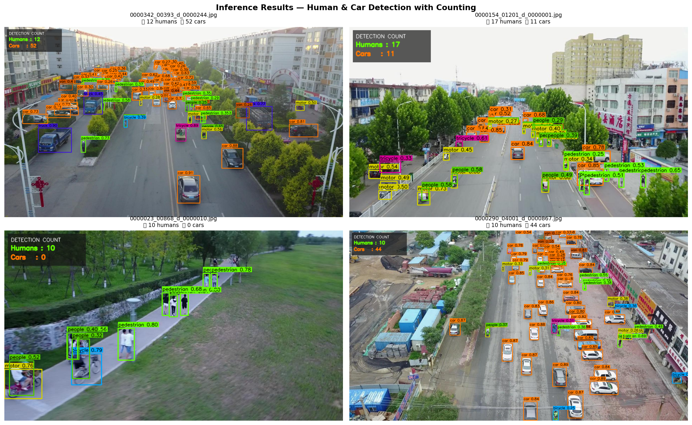
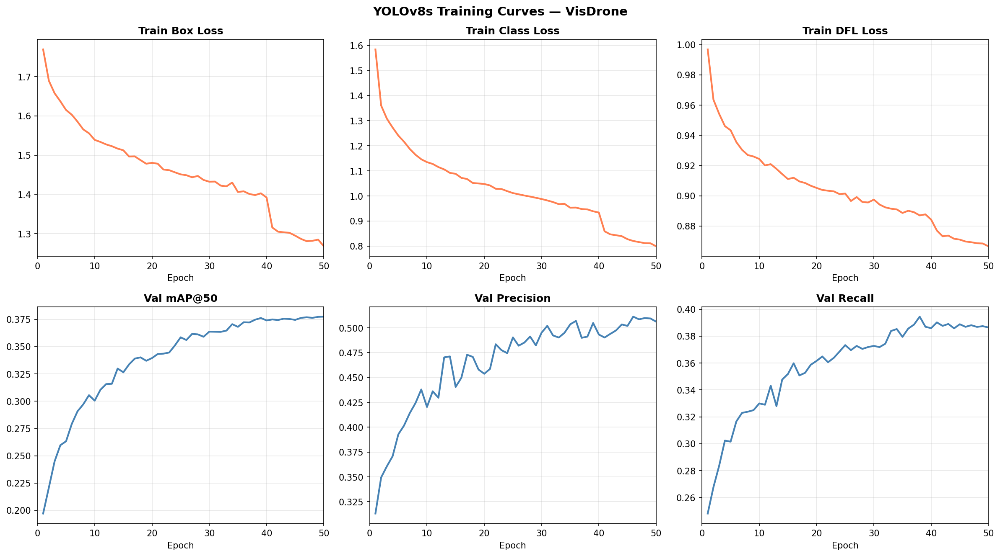
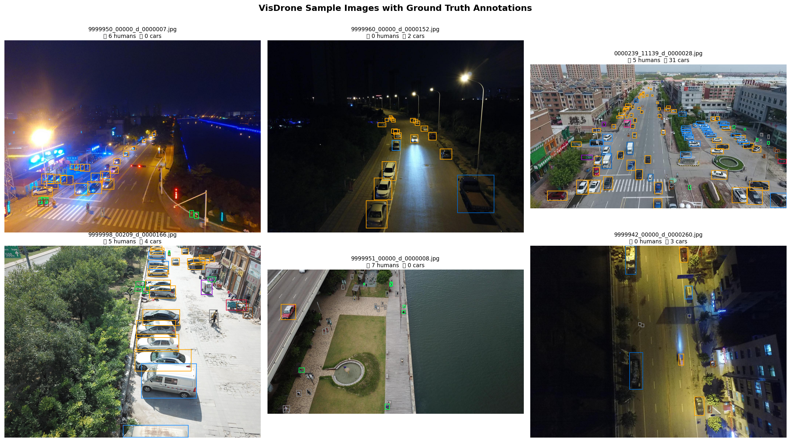

# 🚁 Drone Human & Car Detection System


A drone-based computer vision system for detecting and counting **humans** and **cars** from aerial images and videos using a fine-tuned YOLOv8 model.

---

## 📌 Features

- Human and car detection from drone images
- Object counting with on-screen display
- Video detection with multi-object tracking (ByteTrack)
- Flask-based web interface for easy inference
- YOLOv8 training and evaluation notebooks
- Fine-tuned on the VisDrone dataset

---

## 📸 Demo

### Detection Result



### Training Curves



### Sample Annotations



---

## 📊 Results

| Metric | Value |
|--------|-------|
| Overall mAP@50 | 29.6% |
| Human mAP@50 | 27.2% |
| Car mAP@50 | 52.8% |
| Precision | 58.6% |
| Recall | 35.4% |
| FPS | 39.1 |

---

## 📁 Project Structure

```
drone-detection/
├── assets/
│   └── sample_images/
├── models/
│   └── weights/
│       └── best.pt
├── notebooks/
│   ├── 01_dataset_exploration.ipynb
│   ├── 02_eda.ipynb
│   ├── 03_preprocessing.ipynb
│   ├── 04_training.ipynb
│   ├── 05_evaluation.ipynb
│   └── 06_inference.ipynb
├── outputs/
├── src/
│   ├── config.py
│   ├── detect.py
│   ├── train.py
│   └── track.py
├── webapp/
│   ├── app.py
│   ├── static/
│   └── templates/
├── dataset.yaml
├── requirements.txt
└── README.md
```

---

## 🗃️ Dataset

This project uses the **VisDrone2019-DET** dataset.

Download from Kaggle: [VisDrone Dataset](https://www.kaggle.com/datasets/banuprasadb/visdrone-dataset)

Place the dataset inside:

```
data/raw/VisDrone/
```

---

## ⚙️ Setup

Clone the repository:

```bash
git clone https://github.com/RX-kabir/drone-detection.git
cd drone-detection
```

Create and activate virtual environment:

```bash
python -m venv venv
venv\Scripts\activate
```

Install dependencies:

```bash
pip install -r requirements.txt
```

---

## 🚀 Usage

### Run Web App

```bash
python webapp/app.py
```

Open in browser: `http://localhost:5000`

### Train Model

```bash
python src/train.py
```

### Run Detection

```python
from src.detect import load_model, process_image

model = load_model()

annotated, humans, cars, detections = process_image(
    "path/to/image.jpg",
    "outputs/result.jpg",
    model
)

print("Humans:", humans)
print("Cars:", cars)
```

### Run Tracking (Video)

```bash
python src/track.py --source path/to/video.mp4 --output outputs/tracked.mp4
```

Tracking is implemented using **ByteTrack**, integrated with YOLOv8 inference to assign persistent IDs to detected humans and cars across video frames.

---

## 🏋️ Training Details

| Parameter | Value |
|-----------|-------|
| Model | YOLOv8s |
| Epochs | 50 |
| Batch Size | 8 |
| Image Size | 640 |
| Optimizer | AdamW |
| Dataset | VisDrone2019-DET |
| GPU | NVIDIA RTX 4050 |

---

## ✅ Strengths

- **Real-time capable**: Achieves 39.1 FPS, suitable for live drone feed processing
- **Dual-class detection**: Simultaneously detects both humans and cars in a single pass
- **Domain-specific fine-tuning**: Model trained directly on aerial/drone imagery rather than ground-level data, improving aerial-view accuracy
- **End-to-end pipeline**: Covers dataset exploration, preprocessing, training, evaluation, inference, and a deployable web interface
- **Multi-object tracking**: ByteTrack integration enables consistent ID assignment across video frames, useful for counting unique individuals over time

---

## ⚠️ Limitations

- **Low recall (35.4%)**: The model misses a significant portion of actual humans and cars, especially in very dense scenes
- **Weak human detection (mAP 27.2%)**: Humans appear very small in aerial images (often < 10×10 pixels), making them hard to detect reliably
- **No night/low-light support**: Model was trained on daytime images and may degrade significantly in poor lighting conditions
- **Fixed image size**: Inference at 640px may cause very small objects to be missed; tiled inference could improve this but is not currently implemented
- **Class imbalance**: VisDrone has many more vehicles than pedestrians, contributing to the performance gap between car and human mAP

---

## 🔍 Challenges

- Small objects in aerial images
- Dense crowds and traffic
- Occlusion between objects
- Imbalanced dataset classes
- Aerial-view domain specificity

---

## 🛠️ Tech Stack

- Python
- YOLOv8 (Ultralytics)
- PyTorch
- OpenCV
- Flask
- ByteTrack
- Pandas
- Matplotlib

---


